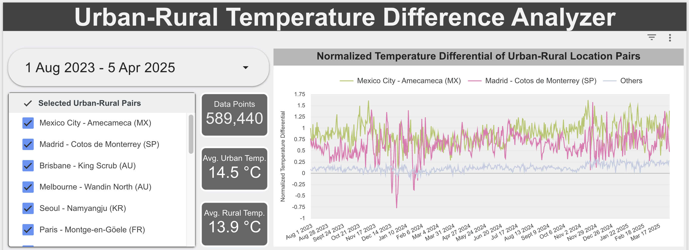

# ETL data pipeline deployed on a micro machine (1 CPU - 1 GB RAM)

[(https://lookerstudio.google.com/reporting/c9e8d7e9-dab1-467e-93ee-116ec058932c)]

## <a href="https://lookerstudio.google.com/reporting/c9e8d7e9-dab1-467e-93ee-116ec058932c">Visit running interactive dashboard</a>

A cloud-based data pipeline that compares temperature variations between urban and rural locations, implemented as a technical exercise rather than a formal study.

## Dashboard Features

The visualization dashboard provides:
- Interactive selection of urban-rural location pairs
- Time period selection
- Comparative normalized temperature differentials across locations
- Summary statistics including average urban and rural temperatures

Notes: 
   - Data points are updated daily.
   - The dashboard is attached to a database and data pipeline that are designed to run within AWS Free Tier limits on a micro EC2 instance, intensive querying of the dashboard may cause connection issues, in such a case, closing and reopening the browser page helps. 

## Project Overview

- Collects historical weather data from the Open-Meteo API
- Processes and examines temperature differentials between urban and rural location pairs
- Visualizes results via Looker Studio 
- Runs on a micro machine

## Technologies Used

- **Programming**: Python, SQL
- **Cloud**: AWS
- **Database**: PostgreSQL
- **Version Control**: Git
- **Containerization**: Docker (for local development, db is constructed directly on host machine on the cloud)
- **Visualization**: Looker Studio
- **Data Source**: Open-Meteo API (historical weather data) - https://open-meteo.com

## Project Structure

```
urban-rural-temperatures/

├── src/           
│   └── urban_rural_temp/
│       ├── __init__.py    
│       ├── config.py         # Configuration details
│       ├── extract.py        # Data extraction from Open-Meteo
│       ├── initial_load.py   # Load historical data
│       ├── load.py           # Database loading functions
│       ├── daily_pipeline.py # Pipeline scheduled to run daily
│       ├── setup_db.py       # Database setup
│       └── utils.py          # Utility functions
├── db/            
│   ├── docker-compose.yml # container setup
│   └── sql/               # SQL definitions
│       ├── schema.sql     # Database schema
│       ├── views.sql      # Materialized views
│       └── indexes.sql    # Database indexes
├── requirements.txt
├── .gitignore
└── README.md          # Project documentation
```


## Analysis

1. **Direct Temperature Differential**: Simple difference between urban and rural temperatures

2. **Normalized Temperature Differential**: An intuitive/practical standardized measure to account for local temperature variability
   - Formula: `Normalized Differential = (urban_temp - rural_temp) / std_dev(rural_temp)`

3. **Calculations over Rolling Window**: The standard deviation of rural temperature is calculated using a 30-day rolling window 

## Ideas for the future
- **Document Deployment Steps**:
   Improve documentation to include the steps to deploy the pipeline & database on a micro machine
- **Daily Pattern Analysis**: 
   Examine urban-rural temperature differences by hour of day. Differences typically peak in evening hours when urban surfaces release stored heat
- **Seasonal Analysis**:
   Compare how urban-rural temperature differentials change across seasons
